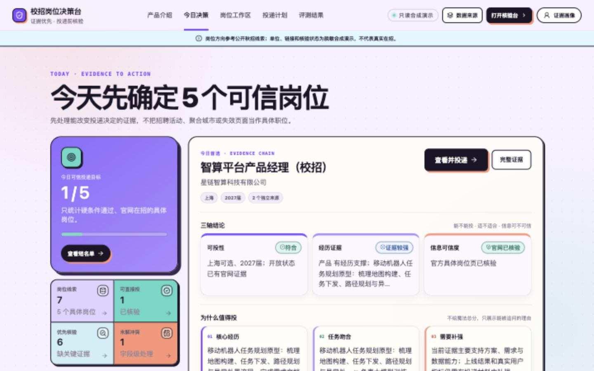
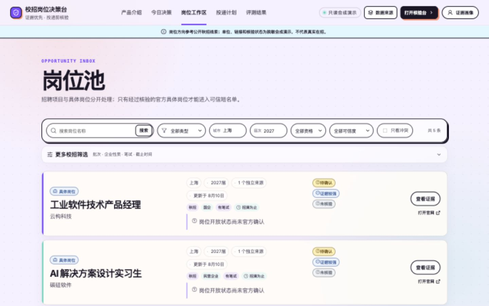
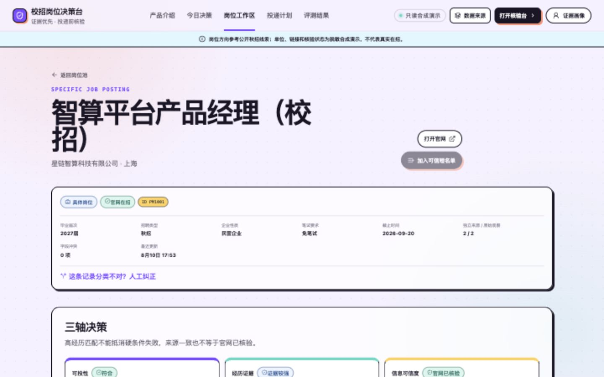
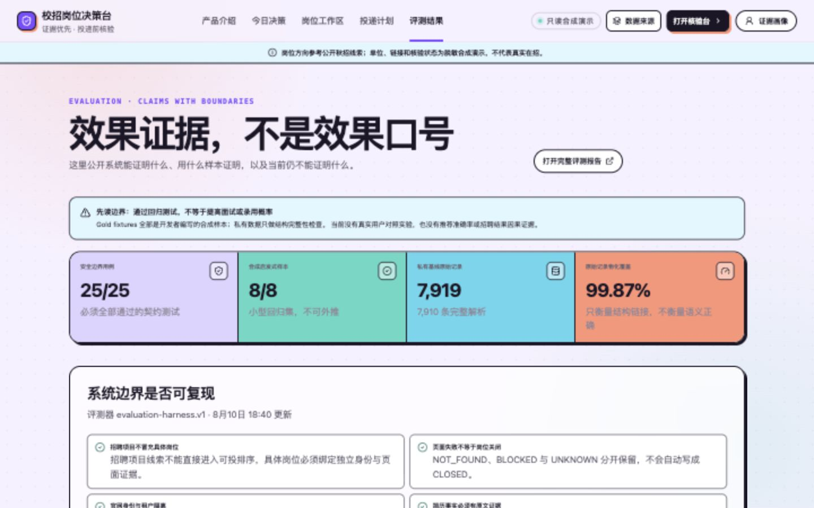

# 校招岗位决策台

> 把多份校招表变成一份能解释、能核验、能安全导出的投递清单。

**[查看产品截图](#产品截图)** · **[一分钟运行只读演示](#一分钟运行只读演示)** · **[阅读产品案例](docs/PRODUCT_CASE_STUDY.md)** · **[查看评测边界](docs/evaluation/report.html)**

国内校招聚合表经常把招聘项目、岗位族和多个城市放在同一行；不同来源又会对届次、截止时间和状态给出不一致说法。这个项目不是再做一个“上传简历 → AI 打 86 分”的求职助手，而是位于岗位表和 Offerbiu 等投递工具上游的**可信决策层**。

系统保留不可变原始行和字段级来源，区分 `Campaign` 与具体 `Posting`，再分别回答：

- **Eligibility：** 明确硬条件是否满足？
- **Evidence Fit：** 简历中有什么已确认的原文证据支撑投递？
- **Trust：** 当前岗位信息能否被官方页面、来源一致性和时间共同支持？



## 产品截图

所有截图均由仓库内的合成岗位与虚构简历生成，不含个人信息或付费表原文。

| 岗位池：招聘项目与具体岗位分流 | 岗位详情：三轴决策与官网身份 |
| --- | --- |
|  |  |

| 评测页：能证明什么，也明确不能证明什么 |
| --- |
|  |

## 为什么值得做

本地最新聚合表包含 7,909 条岗位型记录，其中启发式识别出：

- 53.1% 可能是一行多岗位或宽泛岗位族；
- 39.1% 包含多个城市；
- 77.2% 的截止字段缺失或不是明确日期。

这意味着“先让大模型匹配，再考虑数据是否具体、当前、可信”的顺序本身就不稳。系统因此先解决输入事实，再做个人决策。

## 核心能力

### 1. 可追溯导入

- CSV、TSV、XLSX 与指定 Markdown 快照；
- 飞书/Lark 多维表格 URL 连接：解析 table/view，通过官方 API 分页读到末页；
- 匿名公开分享页可在浏览器中复制表格后粘贴导入，仍经过两阶段预览；不会把浏览器辅助模式冒充为稳定 API；
- 手动或每日同步，记录新增、修改、缺失和未变；读取不完整时不覆盖旧快照；
- 两阶段 `preview → confirm`，先检查字段映射、解析状态和 Campaign/Posting 分类；
- `DataSource → ImportBatch → RawRecord` 不可变血缘；
- 文件字节、字段映射和记录集合分别参与幂等与来源独立性检查。

### 2. Campaign / Posting 分层

- 多岗位、多城市的招聘项目不会自动展开成虚假岗位；
- Campaign 只能进入核验队列，不能进入可信短名单；
- 只有绑定具体官方岗位身份的 Posting 才能进入可投判定与可信导出。

### 3. 字段级证据与保守消歧

- 公司、岗位、城市、届次、招聘批次、企业性质、笔试要求、截止时间、状态和 URL 分别保存 Claim；
- 同权威来源冲突显式展示，不静默覆盖；
- 官方 ID / URL 可精确复用，模糊相似只生成 `REVIEW` 候选；
- 同名岗位、不同城市、不同业务线或不同官方 ID 不会粗暴合并。

### 4. 官网身份与状态核验

- 聚合链接只能成为候选，不能自动成为官网信任锚点；
- 拒绝公共后缀、IP、聚合平台和共享 ATS 父域；
- Greenhouse 等共享 ATS 同时校验公司租户路径；
- `OPEN / CLOSED / NOT_FOUND / BLOCKED / UNKNOWN` 五态分离；
- 404、登录墙或反爬不等于岗位关闭。

### 5. 简历证据画像与三轴决策

- TXT、Markdown 与 PDF 简历解析；
- 规则抽取候选、原文 Span、用户确认和偏好分开存储；
- 未确认事实不参与 Evidence Fit；
- 上传新简历后先生成候选事实，用户勾选确认，再点击“用已确认事实刷新全部岗位”完成批量重算；
- 画像、岗位字段、官网域、岗位身份或证据时效变化后，旧决策自动失效。

### 6. 国内校招筛选与可信投递计划

- 岗位池支持届次、批次、企业性质、笔试要求与 7/14/30 天截止窗口筛选；
- 明确日期可按临近截止排序，无法解析的“招满即止”等表述保持原文，不伪造日期；
- 服务端重新校验具体岗位、标题、硬条件、官网在招状态、三轴新鲜度与 14 天证据窗口；
- 阻断记录可以保留跟踪，但只有 `ready` 记录能导出 CSV、JSON 或 Markdown；
- 可信记录可跟踪待投递、已投递、笔试/测评、面试、Offer、结束或放弃，并记录下一步行动与日期；
- 导出始终使用当前可追溯的具体岗位信息，同时携带投递阶段和下一步。

## 评测证据

当前可复现评测结果：

- 25 / 25 条安全边界契约通过；
- 8 / 8 条开发者编写的合成启发式样本与预期一致；
- 私有聚合基线：7,919 条 RawRecord、7,890 个 Opportunity、79,648 条 FieldClaim；
- 机会实体来源覆盖率 100%，原始记录物化覆盖率 99.87%；
- 本地 TestClient 观测：岗位池首屏中位 28.46 ms，工作区汇总 52.92 ms，详情 3.35 ms。

这些结果证明边界、结构和本地可运行性，**不代表真实推荐准确率、面试率或 Offer 率**。完整可交互报告见 [docs/evaluation/report.html](docs/evaluation/report.html)，原始聚合结果见 [evaluation/results/latest.md](evaluation/results/latest.md)。

## 一分钟运行只读演示

要求：Python 3.9+、Node.js 20.19+ 或 22.12+。

```bash
make install
make demo-db
CJD_ENVIRONMENT=public-demo \
CJD_DATABASE_URL=sqlite:///data/demo/public-demo.sqlite \
npm run dev
```

打开 `http://127.0.0.1:5173/about` 可先看面向作品集访客的产品说明，再进入今日决策与岗位工作区。`public-demo` 只读取合成数据，所有写请求会被服务端拒绝。

演示库会从仓库内的两份合成岗位表和两版“小刘”虚构简历重新生成，因此第一次启动也不会出现空页面。演示中已预置 Campaign/Posting、多来源冲突、官网核验、三轴结果和一条可信短名单。

## 使用自己的简历与岗位表

本地可写工作区：

```bash
make init-db
npm run dev
```

在“证据画像”中上传 TXT、Markdown 或 PDF 后，系统不会直接采信抽取结果。确认需要采用的事实，再点击“用已确认事实刷新全部岗位”，即可批量更新三轴和推荐队列；历史简历仍可切换。这个显式确认步骤用于避免错误抽取静默影响投递判断。

导入用户有权使用的本地表格：

```bash
make import-latest-private
```

路径可覆盖，不需要修改仓库：

```bash
make import-latest-private LATEST_SNAPSHOT='/path/to/authorized-list.md'
```

连接需要登录或权限的飞书多维表格时，凭证仅从本地环境读取，不写入数据库或前端：

```bash
# 二选一：现有 user/tenant access token
export CJD_FEISHU_ACCESS_TOKEN='...'

# 或自建应用凭证（表格必须授权给该应用）
export CJD_FEISHU_APP_ID='cli_...'
export CJD_FEISHU_APP_SECRET='...'
```

在“数据来源与批次”页粘贴 URL，先执行全量预览，再保存连接。手动执行所有 `DAILY` 连接：

```bash
make sync-remote
```

生产或本机定时运行时，由 cron/launchd/Codex 定时任务每日调用该幂等命令；应用进程本身不启动重复调度器。

如果是无需登录、但没有可用 API 凭证的公开分享页，可在浏览器中复制表格并粘贴到“公开飞书分享页”入口。该模式适合临时导入和抽样检查；每日无人值守同步仍使用上面的官方 API 连接。

2026-08-10 已使用公开飞书视图的 300 行真实样本完成导入、分类、画像、三轴计算和短名单门禁检查。聚合统计与诚实边界见 [真实流程检查报告](docs/LIVE_WORKFLOW_REPORT_2026-08-10.md)。

## 质量门禁

```bash
npm run lint
npm run format:check
npm run typecheck
npm test
npm run build
make evaluate
```

## 部署公开只读演示

仓库包含 `Dockerfile` 与 `render.yaml`。部署镜像只复制合成数据，并在构建时重建带内容封印的只读演示库；`data/private`、个人简历、环境变量和所有 SQLite 工作库都不会进入镜像。

```bash
docker build -t campus-job-desk .
docker run --rm -p 8000:8000 campus-job-desk
```

访问 `http://127.0.0.1:8000/about`。推送 GitHub 后也可用 `render.yaml` 创建公开只读演示，再把正式网址放到本 README 首行。

## 技术架构

- Backend：FastAPI、SQLAlchemy、SQLite、Pydantic；
- Frontend：React、TypeScript、Vite；
- Parsing：openpyxl、pypdf；
- Entity review：RapidFuzz 只生成候选，不直接做低置信合并；
- Evaluation：pytest、Vitest、可复现评测器与自包含 HTML 报告。

界面采用从 SolutionScope B 版迁移并针对决策工作台收敛的视觉系统；配色、层级、组件边界和禁用项见 [DESIGN.md](DESIGN.md)。

更完整的数据模型、信任边界和状态机见 [docs/ARCHITECTURE.md](docs/ARCHITECTURE.md)。

## 公开与隐私边界

- 付费表、完整简历和私有数据库只留本地并被 Git 忽略；
- 公开仓库只包含合成数据、聚合指标和脱敏截图；
- 公开在线演示保持只读；需要上传个人简历时，应在本机可写工作区运行，避免把简历个人信息交给公共实例；
- SPA 静态文件路由执行目录 containment，不能读取构建目录外文件；
- 公开演示启动时验证数据源类型，并在服务端统一禁写；
- 系统不抓取或复制 Offerbiu，也不再分发第三方岗位表。

详见 [docs/PRIVACY_AND_DATA.md](docs/PRIVACY_AND_DATA.md)。

## 与已有产品的关系

- Offerbiu / OfferComing：岗位发现、国内校招筛选与投递管理的交互参考；本项目吸收批次/企业性质/笔试/截止维度和基础投递阶段，但不复刻完整 CRM、简历优化或自动填表。
- FreeHire：统一 Schema、来源适配、确定性匹配和事件审计的工程参考；本项目聚焦中国校招届次、批次、聚合表与用户自带来源。
- 本项目的差异化：`BYO Lists + Campaign/Posting + Claim Provenance + Official Verification + Three-axis Decision`。

按“通用求职平台”评价，本项目主动放弃了海量岗位发现、简历改写、自动填表和完整面试 CRM；按“用户自带多份中国校招情报后，如何得到可追溯结论并推进投递”评价，已完成从筛选、核验到行动跟踪的核心闭环。详细功能边界和证据链见 [竞品功能矩阵](docs/COMPETITOR_MATRIX.md)。

## 明确不做

自动投递、全网爬虫、Offer 概率、薪资预测、简历改写、会员体系、通用聊天 Agent、RAG 问答和不可解释的综合匹配百分比。

## 作品集材料

- [产品案例研究](docs/PRODUCT_CASE_STUDY.md)
- [三分钟演示脚本](docs/DEMO_SCRIPT.md)
- [用户任务测试协议](docs/USER_TASK_PROTOCOL.md)
- [简历与面试表述](docs/RESUME_BULLETS.md)
- [数据基线](docs/DATA_BASELINE.md)
- [API 概览](docs/API.md)
- [界面信息架构](docs/UI_INFORMATION_ARCHITECTURE.md)

## 当前边界

产品、合成演示、评测器和文档已完成。真实 3 人任务测试仍需邀请外部参与者执行；在此之前，项目只能声称“工程边界可复现、私有数据结构可追溯”，不能声称“已经验证节省多少时间”或“提升求职结果”。
