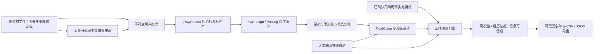

# 系统架构

## 设计目标

系统不是另一个“上传简历后给出 86% 匹配度”的求职助手，而是位于岗位聚合表与投递工具之间的可信决策层。核心约束是：任何会影响投递的结论，都能回到原始行、字段说法、官网证据和计算版本。

## 领域模型

| 实体 | 作用 | 关键不变量 |
| --- | --- | --- |
| `DataSource` | 一个供应商、官方文件或受控演示源 | 同一 `source_id` 的名称、类型和独立来源组不可静默改变 |
| `RemoteSourceConnector` | 可重复同步的飞书 table/view 定义 | 只保存资源标识和映射；access token/app secret 不入库 |
| `SourceSyncRun` | 一次远程全量读取及差异回执 | 必须读到末页才能导入；失败不覆盖上次成功快照 |
| `ImportBatch` | 一次文件快照 | 文件与字段映射共同决定幂等语义；批次不可覆盖 |
| `RawRecord` | 原始行与解析结果 | 导入后不可修改；展示值必须可回到原文 |
| `Opportunity` | 招聘项目或具体岗位 | `Campaign` 不得直接进入投递短名单 |
| `FieldClaim` | 某字段在某来源、某时间的说法 | 同权威来源冲突不得静默覆盖；旧版本保留为历史 |
| `VerificationAttempt` | 对官网页面的人工辅助核验 | `NOT_FOUND`、`BLOCKED`、`UNKNOWN` 与 `CLOSED` 分开；证据绑定粒度、域名、岗位身份和时间 |
| `ProfileFact` | 有原文片段的简历事实 | 规则抽取与用户确认分开；未经确认不参与决策 |
| `DecisionSnapshot` | 一个版本化三轴结论 | 画像、字段、官网域、岗位身份或证据新鲜度变化后旧结论失效 |
| `ShortlistEntry` | 用户保留的候选 | 导出前重新检查具体岗位、可投性、官网状态、可信度和 14 天证据窗口 |

## 三轴决策

系统拒绝把所有判断压成一个“匹配百分比”。

- `Eligibility`：只判断明确硬条件。任何明确不符即 `FAIL`；关键字段缺失即 `UNKNOWN`，不把缺失当满足。
- `Evidence Fit`：只把已确认的简历事实与岗位任务词建立引用关系。它表示“是否有证据支撑投递叙事”，不表示录用概率。
- `Trust`：区分官网已核验、多独立来源一致、冲突、陈旧和未知。聚合表的链接本身不构成官网信任锚点。

## 信任边界

1. 付费表或公开聚合表中的 URL 只能成为候选域名，不能自动成为公司官网。
2. 官方域名必须显式确认；公共后缀、IP、localhost、聚合平台和共享托管后缀被拒绝。
3. 具体岗位核验必须绑定已确认域名、具体岗位 URL 结构和官方岗位 ID；招聘首页不能被包装为具体岗位页。
4. 官网页面没有写某字段，不等于否定供应商的说法；该字段保持未知或冲突。
5. 只有官网明确关闭，才能标记 `CLOSED`；404、登录墙和反爬分别保留为 `NOT_FOUND` 或 `BLOCKED`。

## 运行形态

- 本地工作区：可导入私有表格、维护简历证据、核验和导出。
- 公开演示：只读合成数据；启动前先锁定精确的演示库路径，再校验合成来源、工作区标记与全库内容封签，不在演示启动期间执行迁移或决策刷新。
- 前后端：FastAPI + SQLAlchemy + SQLite，React + TypeScript + Vite。
- 排序与消歧：确定性规则与 RapidFuzz 只生成候选；低置信结果交给用户复核。
- 远程同步：飞书官方 Bitable API 单页最多 500 条，服务按 `page_token` 继续到 `has_more=false`；每日调度交给外部 cron/launchd/定时任务，同步脚本本身幂等。

## 非目标

项目不做自动投递、简历改写、Offer 概率、全网爬虫、通用聊天 Agent、薪资预测或邮箱/日历型完整投递 CRM。它只记录可信岗位的基础投递阶段、下一步与日期，并可继续导出给下游工具。
